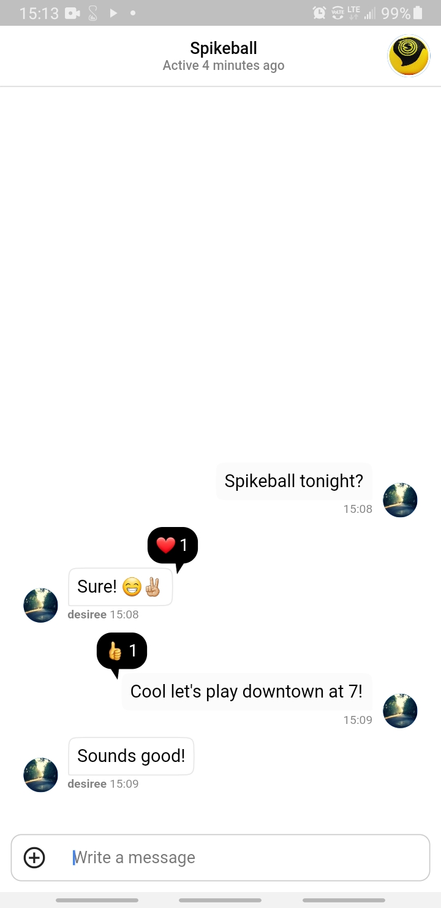
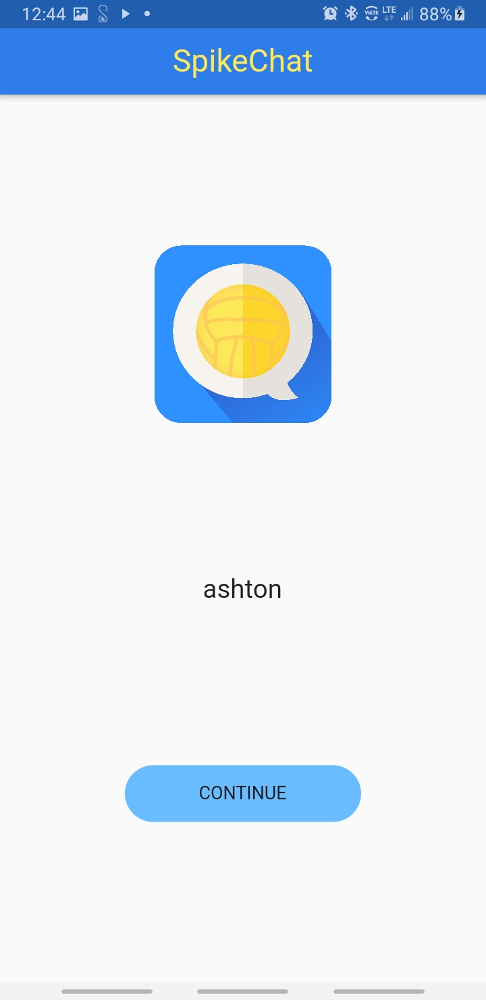
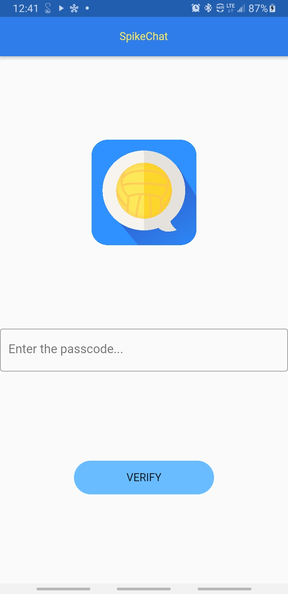

# 🏐 SpikeChat

-------
A fully functional chat application built with Flutter and Stream!
* ✅  Join the chat room (If you have the secret passcode hehe)
* ✅  Send text, images, audio, and video in the chat
* ✅  React to messages (i.e. *heart react*) and see the reaction count
* ✅  See when the chat was last active

## 🚀 Motivation
I found out about Stream's chat API and wanted to experiment with it. I decided to build a Spikeball group chat application for me and my friends to plan times to play Spikeball.

## 🖥 Technologies used

<b>Built with</b>
- Flutter SDK
- Dart
- [Stream SDK](https://getstream.io/chat/get_started/)
- [Material Design](https://material.io/)

## 📚 Libraries used

* [stream_chat_flutter](https://pub.dev/packages/stream_chat_flutter)
* [stream_chat](https://pub.dev/packages/stream_chat)
* [file_picker](https://pub.dev/packages/file_picker)
* [video_player](https://pub.dev/packages/video_player)
* [image_picker](https://pub.dev/packages/image_picker)
* [provider](https://pub.dev/packages/provider)  
* [google_fonts](https://pub.dev/packages/google_fonts)
* [start_jwt](https://pub.dev/packages/start_jwt)
* [shared_preferences](https://pub.dev/packages/shared_preferences)

## 👨🏻‍💻 Developed By
[Ashton Jones](https://www.ashtonjones.dev/) 

👨‍💻 Google Certified Android Engineer |
✍ Writer |
🧘‍♂️ Stoic
👨🏻‍💻 Ashton Jones
📩 ashtonjonesdev@gmail.com
🌐 www.ashtonjones.dev

Copyright 2020 Ashton Jones

## 📸 Screenshots
&ensp;&ensp;&ensp;

